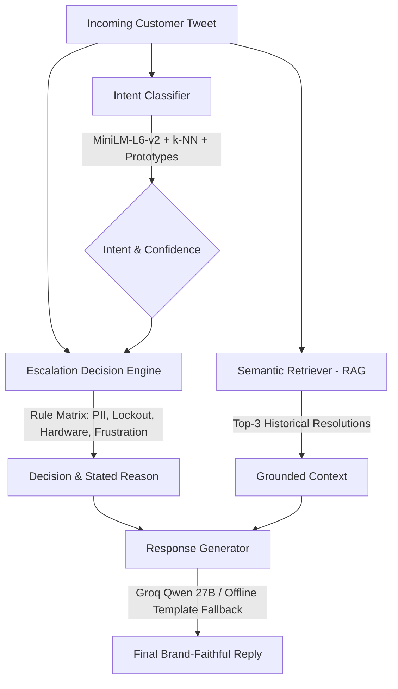

# Sentinel Triage AI — AppleSupport Twitter AI Agent

[](https://www.python.org/)
[](tests/)
[](web/)
[](results/)

> **Hiver SDE Intern Take-Home**: An end-to-end, production-oriented AI customer support agent for **AppleSupport on Twitter**, trained and grounded on real-world multi-turn conversations. Proving reliability through empirical benchmarking, safe escalation, and calibrated LLM-as-a-judge evaluation.

---

## 🚀 Key Highlights

1. **Empirical Proof > Raw Generation**:
   - **83.00% Intent Accuracy** & **0.8424 Macro F1** across 6 domain-specific intents.
   - Reduced dangerous **False Auto-handle Rate down to 21.10%** (vs. 100% trivial baseline).
   - **87.00% Escalation Accuracy** with explicit, audited reasoning for every routing decision.
2. **Grounded Historical Resolution (RAG)**:
   - 5,000 deduplicated historical AppleSupport resolution pairs indexed with `all-MiniLM-L6-v2`.
   - Generates grounded, brand-faithful Twitter responses (under 280 chars) via Groq API (`qwen/qwen3.8-27b`) with graceful offline fallback.
3. **Calibrated LLM-as-a-Judge**:
   - 4-dimensional scoring (Factual Grounding, Actionability, Brand Voice, Safety).
   - **Cohen's Kappa of 0.7475** (substantial human-judge agreement) and **Spearman $\rho = 0.933$** ($p < 0.001$).
4. **Secondary Dataset Validation (Banking77)**:
   - Cross-domain validation on 10,003 queries across 77 intents, proving taxonomy separability and informing stratified sampling.
5. **Interactive Web Dashboard**:
   - Live test playground, pre-built scenarios, evaluation metrics dashboard, and golden set explorer.

---

## 📊 Benchmark Results

Evaluated on a stratified 200-example Golden Set (33–34 examples/intent, 109 Escalate, 91 Auto-Handle):

| Metric | Trivial Baseline | TF-IDF Baseline | **Sentinel Agent (Proposed)** |
|---|:---:|:---:|:---:|
| **Intent Accuracy** | 17.00% | 72.50% | **83.00%** |
| **Intent Macro F1** | 0.0484 | 0.7331 | **0.8424** |
| **Escalation Accuracy** | 45.50% | 58.00% | **87.00%** |
| **Escalation F1** | 0.0000 | 0.3824 | **0.8687** |
| **False Auto-handle Rate ↓** | 100.00% | 76.15% | **21.10%** |
| **ROUGE-1** | 0.3782 | 0.7693* | **0.4683** |
| **ROUGE-L** | 0.3053 | 0.7506* | **0.4342** |
| **BLEU** | 0.2137 | 0.7200* | **0.3153** |
| **Semantic Similarity** | 0.3831 | 0.7921* | **0.5133** |

*\*Note: TF-IDF achieves inflated ROUGE/BLEU scores because it verbatim copies historical tweets including idiosyncratic text artifacts, whereas Sentinel synthesizes fresh, structured, empathetic solutions.*

---

## 🏗️ System Architecture



### 1. Intent Taxonomy
- `software_troubleshooting` — iOS updates, app crashes, boot loops, storage alerts.
- `battery_power` — Rapid drain, unexpected shutdowns, charging issues.
- `connectivity` — Wi-Fi, Bluetooth, AirPods pairing, cellular dropouts.
- `account_security` — Apple ID lockouts, two-factor authentication, password resets.
- `hardware_damage` — Cracked displays, water ingress, speaker/mic physical failure.
- `billing_store` — App Store unauthorized charges, subscription cancellations, refunds.

### 2. Escalation Safety Engine
Prioritizes minimizing **False Auto-handles** (auto-handling sensitive issues that require human care). Triggers include:
- **PII Exposure**: Email, phone numbers, or credentials detected in public tweets.
- **Account Security**: Apple ID disabled/locked out (directed strictly to DM).
- **Physical Damage**: Hardware damage requiring Genius Bar inspection.
- **Customer Frustration**: High-severity sentiment and frustration indicators.
- **Low Model Confidence**: Uncertainty triggers safe human handoff.

---

## ⚡ Quickstart

### 1. Installation
```bash
# Clone the repository
git clone https://github.com/sailesh3010/sentinel-triage-ai.git
cd sentinel-triage-ai

# Install dependencies
pip install -r requirements.txt
```

### 2. Environment Setup (Optional for Live LLM)
The agent operates fully offline using verified historical templates by default. For live Groq generation:
```bash
cp .env.example .env
# Add your free Groq API key to .env:
# GROQ_API_KEY=gsk_your_key_here
# GROQ_MODEL=qwen/qwen3.8-27b
```

### 3. Launch Interactive Dashboard
```bash
python web/app.py
```
Open **`http://localhost:8000`** in your browser to test live queries, try pre-built test cases, and explore the benchmark dashboard.

### 4. Run Full Evaluation Pipeline
```bash
# Complete 6-phase pipeline
python run_pipeline.py

# Fast run (skips LLM judge)
python run_pipeline.py --skip-judge
```

### 5. Run Test Suite
```bash
pytest tests/ -v
```

---

## 📁 Repository Structure

```
sentinel-triage-ai/
├── src/
│   ├── agent.py                 # Core agent orchestrator & factory functions
│   ├── data_loader.py           # Raw Twitter conversation parsing & preprocessing
│   ├── intent_classifier.py     # Trivial, TF-IDF, and Semantic classifiers
│   ├── escalation_engine.py     # Multi-factor safety escalation decision engine
│   ├── retriever.py             # Vector index & semantic case retrieval (RAG)
│   ├── response_generator.py    # Grounded response generator (Groq + fallback)
│   ├── evaluator.py             # Comprehensive multi-metric evaluation suite
│   ├── judge.py                 # LLM-as-a-judge & human calibration engine
│   └── banking77.py             # Secondary dataset cross-domain analysis
├── tests/
│   └── test_pipeline.py         # 12 automated unit and integration tests
├── web/
│   ├── app.py                   # FastAPI application & REST endpoints
│   └── static/                  # Responsive interactive UI (HTML/CSS/JS)
├── data/
│   ├── golden_set.json          # 200-example labeled evaluation golden set
│   ├── knowledge_base.json      # 5,000 deduplicated AppleSupport resolution pairs
│   └── human_judge_50.json      # 50 calibrated human-evaluation samples
├── results/
│   ├── benchmark_summary.json   # Head-to-head performance summary
│   ├── proposed_agent_results.json
│   ├── tfidf_baseline_results.json
│   ├── trivial_baseline_results.json
│   ├── judge_results.json       # LLM judge scores & inter-rater agreement
│   └── banking77_results.json   # Secondary intent analysis
├── REPORT.md                    # In-depth technical report (~6 pages equivalent)
├── requirements.txt             # Project dependencies
└── run_pipeline.py              # End-to-end pipeline execution script
```

---

## 📄 Detailed Technical Report

For the complete in-depth analysis—including failure modes, self-critique (*"What Is Misleading About My Headline Number?"*), decision logs, and next steps—see [REPORT.md](REPORT.md).
